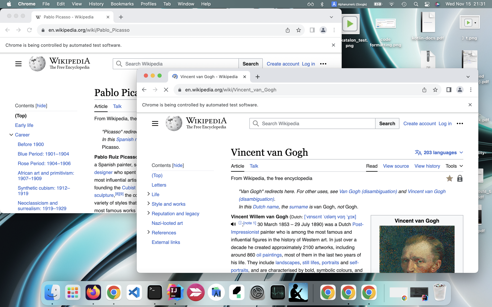

# browserwindowlayout

-   author: kazurayam

-   date: Nov 2023

-   repository: <https://github.com/kazurayam/browserwindowlayout>

## Problem to solve

Often I write an automated Web UI test which opens 2 or more multiple Browser window and work on them simultaneously. The code that work on a browser window is nothing special. Adding to that, I want to manage the layout of all browser windows nicely so that the windows are properly sized and located on the display view port. Window layout management deserves a dedicated set of library. So I made this.

## Solution

Selenium WebDriver provides the fundamental API to manage the position and size of a browser window.

-   WebDriver.manage().window().setPosition(position)

-   WebDriver.manage().window().setSize(dimension)

Here the **position** is an instance of [`org.opeqa.selenium.Point`](https://javadoc.io/doc/org.seleniumhq.selenium/selenium-api/latest/org/openqa/selenium/Point.html) class, the **dimension** is an intance of [`org.openqa.selenium.Dimension`](https://javadoc.io/doc/org.seleniumhq.selenium/selenium-api/latest/org/openqa/selenium/Dimension.html) class.

Provided that you could calculate the **position** and the **dimension** of a browser window, your code can locate it at the desired place. So this library helps your code to calculate the **position** and the **dimension** of the browser windows.

## Description

This library support two ways of window layout:

-   Tiling layout
    

-   Stacking layout
    

## Sample codes

### Launch Multiple Chrome windows in Tiling layout

    package examples

    import com.kazurayam.browserwindowlayout.BrowserWindowLayoutManager
    import com.kazurayam.browserwindowlayout.TilingCellLayoutMetrics

    import io.github.bonigarcia.wdm.WebDriverManager
    import org.junit.BeforeClass
    import org.junit.Test
    import org.openqa.selenium.chrome.ChromeDriver

    class LaunchMultipleChromeWindowsInTilingLayoutTest {

        @Test
        void test_open2windows_in_tiling_layout() {
            TilingCellLayoutMetrics layoutMetrics =
                    new TilingCellLayoutMetrics.Builder(2).build()
            ChromeDriver driver0 = new ChromeDriver()
            ChromeDriver driver1 = new ChromeDriver()
            BrowserWindowLayoutManager.layout(driver0,
                    layoutMetrics.getCellPosition(0),
                    layoutMetrics.getCellDimension(0))
            BrowserWindowLayoutManager.layout(driver1,
                    layoutMetrics.getCellPosition(1),
                    layoutMetrics.getCellDimension(1))
            driver0.navigate().to("https://en.wikipedia.org/wiki/Pablo_Picasso")
            driver1.navigate().to("https://en.wikipedia.org/wiki/Vincent_van_Gogh")
            Thread.sleep(1000)
            driver0.quit()
            driver1.quit()
        }

        @BeforeClass
        static void beforeClass() {
            // setup the ChromeDriver binary
            WebDriverManager.chromedriver().setup()
        }
    }

Here is a [demonstration movie](https://drive.google.com/file/d/1sx57ywf4yVqNO4sCHZ8FWsBcHTz9jo9G/view?usp=sharing).

### Launch Multiple Chrome windows in Stacking layout

    package examples

    import com.kazurayam.browserwindowlayout.BrowserWindowLayoutManager
    import com.kazurayam.browserwindowlayout.StackingCellLayoutMetrics
    import io.github.bonigarcia.wdm.WebDriverManager
    import org.junit.BeforeClass
    import org.junit.Test
    import org.openqa.selenium.Dimension
    import org.openqa.selenium.Point
    import org.openqa.selenium.chrome.ChromeDriver

    class LaunchMultipleChromeWindowsInStackingLayoutTest {

        @Test
        void test_open2windows_in_stacking_layout() {
            StackingCellLayoutMetrics layoutMetrics =
                    new StackingCellLayoutMetrics.Builder(2)
                            .cellDimension(new Dimension(1000, 600))
                            .disposition(new Point(400, 200))
                            .build()
            ChromeDriver driver0 = new ChromeDriver()
            BrowserWindowLayoutManager.layout(driver0,
                    layoutMetrics.getCellPosition(0),
                    layoutMetrics.getCellDimension(0))
            ChromeDriver driver1 = new ChromeDriver()
            BrowserWindowLayoutManager.layout(driver1,
                    layoutMetrics.getCellPosition(1),
                    layoutMetrics.getCellDimension(1))
            driver0.navigate().to("https://en.wikipedia.org/wiki/Pablo_Picasso")
            driver1.navigate().to("https://en.wikipedia.org/wiki/Vincent_van_Gogh")
            Thread.sleep(1000)
            driver0.quit()
            driver1.quit()
        }

        @BeforeClass
        static void beforeClass() {
            // setup the ChromeDriver binary
            WebDriverManager.chromedriver().setup()
        }

    }
