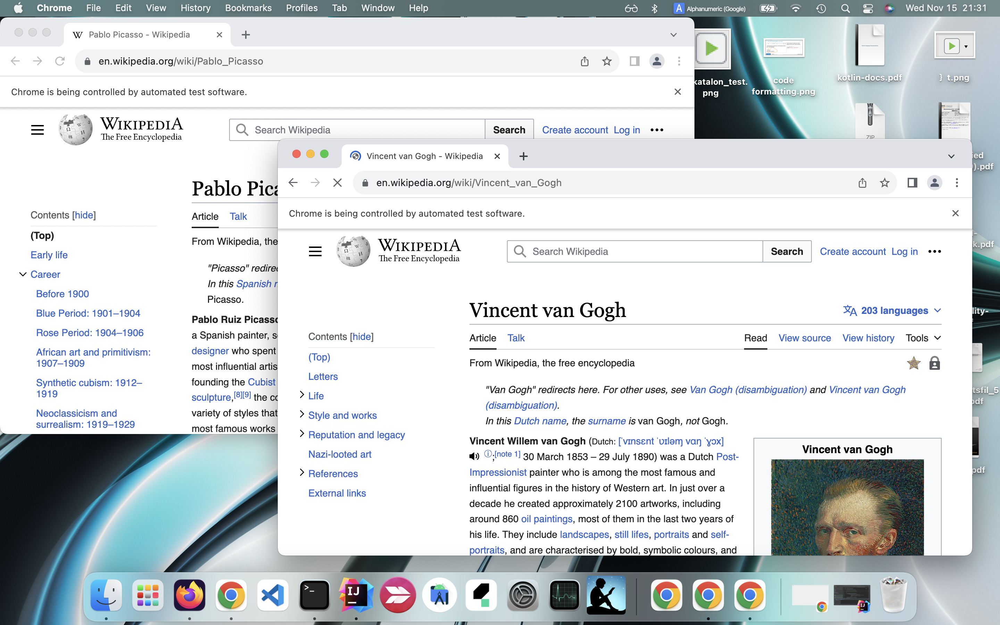

= browserwindowlayout
:toc:

- author: kazurayam
- date: Nov 2023
- repository: https://github.com/kazurayam/browserwindowlayout

== Problem to solve

Often I write an automated Web UI test which opens 2 or more multiple Browser window and work on them simultaneously. The code that work on a browser window is nothing special. Adding to that, I want to manage the layout of all browser windows nicely so that the windows are properly sized and located on the display view port. Window layout management deserves a dedicated set of library. So I made this.

== Solution

Selenium WebDriver provides the fundamental API to manage the position and size of a browser window.

- WebDriver.manage().window().setPosition(position)
- WebDriver.manage().window().setSize(dimension)

Here the *position* is an instance of link:https://javadoc.io/doc/org.seleniumhq.selenium/selenium-api/latest/org/openqa/selenium/Point.html[`org.opeqa.selenium.Point`] class, the *dimension* is an intance of link:https://javadoc.io/doc/org.seleniumhq.selenium/selenium-api/latest/org/openqa/selenium/Dimension.html[`org.openqa.selenium.Dimension`] class.

Provided that you could calculate the *position* and the *dimension* of a browser window, your code can locate it at the desired place. So this library helps your code to calculate the *position* and the *dimension* of the browser windows.

== Description

This library support two ways of window layout:

- Tiling layout
image:images/10_LaunchMultipleChromeWindowsInTilingLayout.png[]

- Stacking layout

== Sample codes

=== Launch Multiple Chrome windows in Tiling layout

[source, groovy]
----
include::../src/test/groovy/examples/LaunchMultipleChromeWindowsInTilingLayoutTest.groovy[]
----

Here is a https://drive.google.com/file/d/1sx57ywf4yVqNO4sCHZ8FWsBcHTz9jo9G/view?usp=sharing[demonstration movie].

=== Launch Multiple Chrome windows in Stacking layout

[source, groovy]
----
include::../src/test/groovy/examples/LaunchMultipleChromeWindowsInStackingLayoutTest.groovy[]
----

